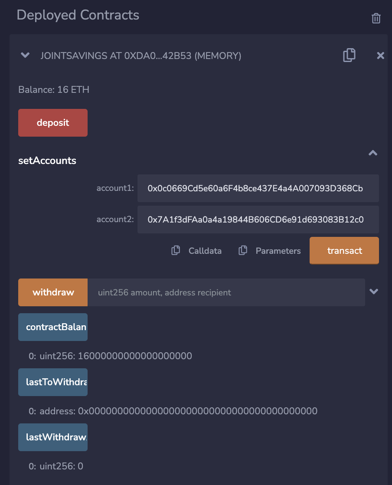

# Module20

## **Purpose of the Project**

We'll be creating a Solidity smart contract that accepts two user addresses. These addresses will be able to control a joint savings account.

The smart contract will use ether management functions to provide the features of a joint savings account such as the ability to deposit and withdraw funds from the account.

## **Screenshots**

Step 1: Use the setAccounts function to define the authorized Ethereum address that will be able to withdraw funds from your contract.

Step 2: Test the deposit functionality of your smart contract by sending the following amounts of ether. After each transaction, use the contractBalance functino to verify that the funds were added to your contract:

### *Transaction 1: Send 1 ether as wei*

### *Transaction 2: Send 10 ether as wei*

### *Transaction 3: Send 5 ether*

Step 3: Withdraw 5 Ether into accountOne and 10 ether into accountTwo. After each transaction, use the contractBalance function to verify that the funds were withdrawn from your contract. Also, use the lastToWithdraw and lastWithdrawAmount functions to verify that the address and amount were correct.

### **Withdraw 5 Ether to accountOne**

### **Withdraw 10 Ether to accountTwo**

## **Contributors**

Marvin Lee